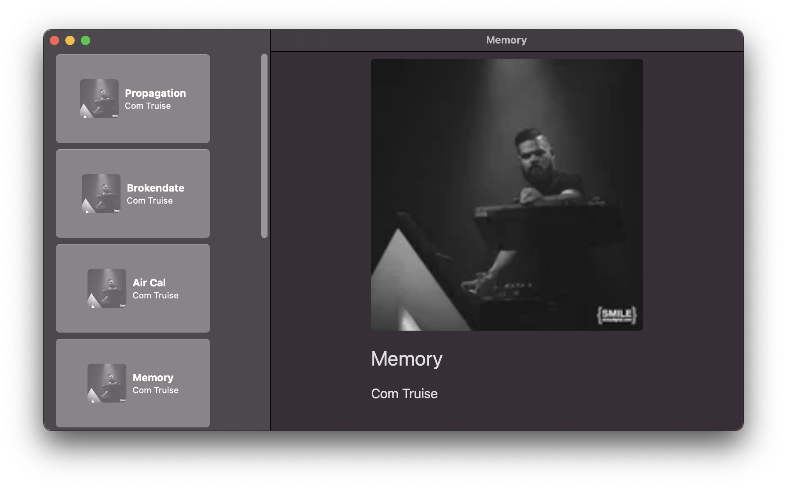

# Botify What is this?

A simple GraphQL Application booystrap with Apollo Federation running on Rust / Warp. With APollo in an XCode project with codegen...

# Getting started...

From the project root run
Run `cd botify_server && docker compose up --build`
Server will be available on localhost:8081

# With XCode Project

Open `Botify/Botify.xcodeproj`

To generate schemas `cd Botify` then `sh ./gen_code.sh`
